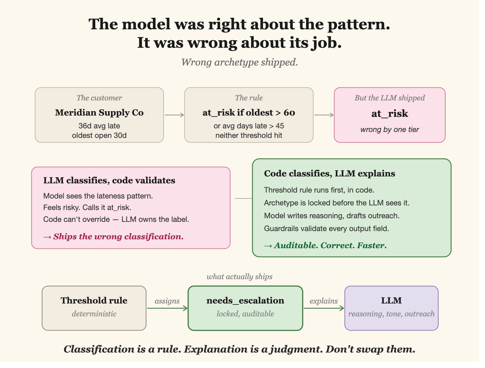

# DSO Signal


<p align="center"> 
  
  <br/>An upstream triage layer for AR automation. 
</p>

A cashflow wedge for AR teams — deterministic forecasting, confidence-scored collections triage. Built in a weekend for Monk.

**Live demo:** [dso-signal.vercel.app](https://dso-signal.vercel.app) · **Code:** you're here

## What this is

DSO Signal ingests an AR aging CSV and returns two things a finance lead uses on Monday morning: a confidence-banded 30/60/90-day cashflow forecast, and a per-customer collections queue with archetype, confidence, and a drafted first-touch email. Archetypes are `reliable`, `gentle_nudge`, `needs_escalation`, `at_risk`, `insufficient_data`. For non-reliable customers, Claude drafts warm, specific outreach — never templated dunning. Any judgment below 0.7 confidence is automatically flagged for human review.

I built this as a wedge upstream of Monk's current product. Monk's own writing makes the case plainly: _Billed vs. Collected Revenue_ argues billing and collecting are two different problems, and _Overdue Invoices Are Not Always a Payment Problem_ treats chronic lateness as behavioral, not financial. Monk's platform solves the back half — AR automation once a receivable is in motion.

DSO Signal solves the front half: it gives a finance lead a reason to log in before they have a collections problem, then hands enriched, triaged accounts to Monk. The pitch inside the account becomes forecasting, not invoicing.

## The architectural decision that mattered

The diagram above is the whole story. My first build had the LLM classify archetypes, with deterministic thresholds sitting downstream as validators. On the Meridian test case, this shipped the wrong label — the model wanted to call a 36-day-late customer `at_risk` because the pattern felt risky, even though the threshold rule said `needs_escalation`. I inverted the boundary: code classifies, LLM explains.

**Classification is a rule. Explanation is a judgment. Don't swap them.**

## Architecture principles

Every decision here mirrors a principle from Monk's own engineering posts.

- **Schema-first extraction** → [`lib/types.ts`](lib/types.ts). Output shapes are defined before any LLM call; the model fills a schema, it doesn't invent one.

- **Deterministic classification, probabilistic explanation** → [`lib/judge.ts`](lib/judge.ts). The archetype is assigned by threshold rules in code (`deterministicArchetypeFloor`) and passed into the LLM as input. The model is told the archetype and asked only to explain it, recommend an action, and draft outreach. Mirrors Monk's principle: _"Deterministic business rules layered on top of probabilistic extraction. The LLM extracts. Deterministic logic validates."_

- **Confidence as a first-class field** → every `CustomerJudgment` carries a `confidence ∈ [0,1]`. The model is instructed to cap at 0.6 when history is thin and only cross 0.85 on crystal-clear patterns.

- **Human-in-the-loop routing via threshold** → `needs_human_review` is derived from `confidence < 0.7` _after_ the model responds. The model cannot opt out of review.

- **Guardrails on LLM output** → structural validation in [`lib/judge.ts`](lib/judge.ts): archetype must be one of five literals, confidence clamped, `suggested_touch` shape-checked, missing customers replaced with fallback.

- **Graceful degradation** → [`deterministicFallback`](lib/judge.ts) classifies by rules when the API key is missing, the call fails, or the response fails validation. The product stays usable; a flag tells the UI.

## Running it

```bash
npm install
cp .env.local.example .env.local   # paste your API key
npm run dev
```

Open [http://localhost:3000](http://localhost:3000). The dashboard loads with bundled mock data (7 customers, one per archetype) so the page is alive on first paint.

## What I'd build next (if hired)

- **Salesforce / HubSpot ingestion** to pull real AR data live instead of CSV upload. The CSV path is the demo wedge, not the product.

- **Per-customer forecast explainability** — surface the math that produced each prediction ("we expect $412K by day 30 because these four customers collectively account for 78% of the probability mass, with the following aging penalties applied"). Auditable predictions are the price of entry for finance tools.

- **Feedback loop on drafted touches** — when a collector marks a Claude-drafted email as "too aggressive" or "not specific enough", capture that signal and update per-account few-shot examples so the tone learns the collector's voice over time. Tone-per-account, not tone-per-tenant.

- **A "why Monk" narrative generator** — the forecast already knows which customers are at risk and why. One more step: surface that narrative to the finance lead in a format they can forward to their CEO. A free tool that does Monk's top-of-funnel qualification for them.

---

Built by Rashmi Subhash · [LinkedIn](https://linkedin.com/in/rashmi-subhash) · [rashmi.bsubash@gmail.com](mailto:rashmi.bsubash@gmail.com)